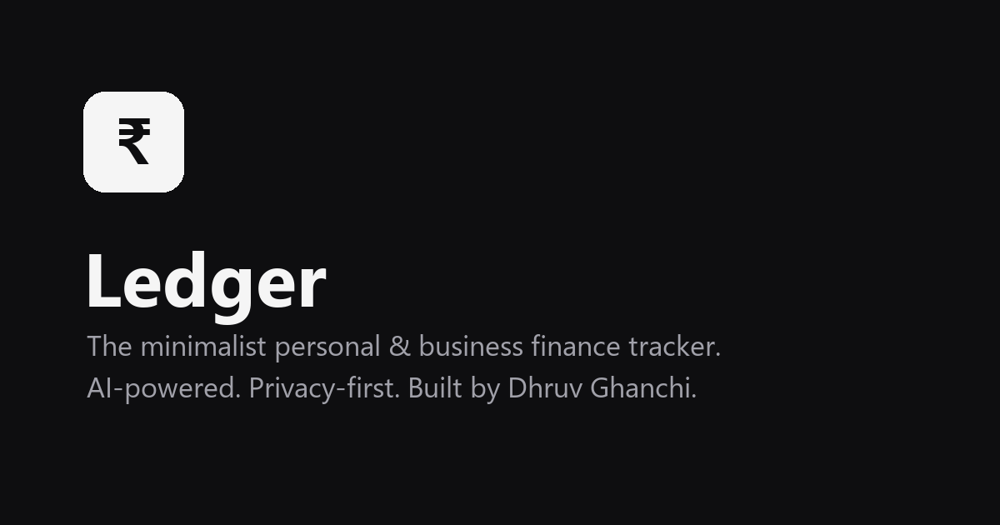

<div align="center">



### The minimalist, privacy-first personal & business finance tracker.

[](https://ledger-dhruv-ghanchi.vercel.app)
[](https://github.com/Dhruv-Ghanchi/Ledger-Finance-Tracker/releases/latest/download/Ledger.apk)
[]()

**[Live Demo](https://ledger-dhruv-ghanchi.vercel.app)** · **[Report a Bug](https://github.com/Dhruv-Ghanchi/Ledger-Finance-Tracker/issues)** · **[Request a Feature](https://github.com/Dhruv-Ghanchi/Ledger-Finance-Tracker/issues)**

</div>

---

Ledger is an AI-powered platform for tracking personal and business finances — replacing manual spreadsheet entry with conversational logging, automatic receipt scanning, and clean, real-time dashboards. It runs on the web and as native Android/iOS apps, all backed by the same account.

## ✨ Features

**AI-Powered**
- 🤖 **KOIN AI Co-pilot** — chat naturally ("log ₹500 on groceries", "how much did I spend on food this month?") and KOIN logs entries or answers from your real data
- 📷 **Smart Receipt Scanning** — photograph a receipt or upload a bank statement; amount, date, category, and vendor are extracted automatically
- 📄 **Professional PDF Invoices** — generate itemized monthly/yearly statements in one click

**Core Tracking**
- 💼 **Personal & Business Scopes** — two fully separated ledgers, one account
- 🤝 **IOUs & Debts** — track who owes who, settle partially or in full
- 📊 **Live Dashboards** — income vs. expense trends, category breakdowns, net worth over time
- 🇮🇳 **Indian Financial Year Native** — April–March FY handling built in, not bolted on
- 🗂️ **Unlimited Custom Categories** — 11 smart defaults, add as many as you need
- 📤 **CSV / Excel Export** — your data, portable, always

**Account & Trust**
- 🔐 Google OAuth or email/password via Firebase Auth
- 🗑️ **Self-service account deletion** — permanently erase your account and all data, anytime, from Profile Settings
- 🆓 **6-month free trial**, no card required

## 💳 Pricing

| Plan | Price | Notes |
|---|---|---|
| Free Trial | ₹0 | Full premium access for 6 months |
| Monthly | ₹11 / month | |
| Yearly | ₹51 / year | ~61% cheaper than monthly |

## 📱 Get the App

| Platform | Status |
|---|---|
| **Web** | [ledger-dhruv-ghanchi.vercel.app](https://ledger-dhruv-ghanchi.vercel.app) — works everywhere, installable as a PWA |
| **Android** | [Direct APK download](https://github.com/Dhruv-Ghanchi/Ledger-Finance-Tracker/releases/latest/download/Ledger.apk) — signed release build, no Play Store needed |
| **iOS** | Coming soon — use the web app in Safari in the meantime |

## 🧰 Tech Stack

| Layer | Technology |
|---|---|
| **Web frontend** | React 19, Tailwind CSS, shadcn/ui, Recharts |
| **Mobile** | Flutter (Android + iOS), Riverpod |
| **Backend** | FastAPI (Python), Motor (async MongoDB driver) |
| **Database** | MongoDB Atlas |
| **Auth** | Firebase Authentication |
| **Payments** | Razorpay |
| **AI** | Google Gemini (primary), Groq (fallback) |
| **Deployment** | Vercel (web), Render (API), MongoDB Atlas (data) |

## 🚀 Local Development

### Prerequisites
Node.js 18+, Python 3.11+, a MongoDB connection, a Firebase project, and (optionally) Razorpay + Gemini API keys.

### Backend
```bash
cd app/backend
python -m venv venv
source venv/bin/activate   # Windows: venv\Scripts\activate
pip install -r requirements.txt
cp .env.example .env       # fill in your Mongo URL, Firebase creds, Razorpay & Gemini keys
uvicorn main:app --reload --port 8000
```

### Frontend
```bash
cd app/frontend
cp .env.example .env       # fill in Firebase client config, Razorpay key, backend URL
npm install --legacy-peer-deps
npm start
```

### Mobile
```bash
cd app/mobile
flutter pub get
flutter run
```

## 🗺️ Repository Structure

```
app/
├── backend/    FastAPI service — auth, entries, subscriptions, AI chat, invoices
├── frontend/   React web app
└── mobile/     Flutter app (Android + iOS)
```

## 🤝 Contributing

Found a bug or have an idea? [Open an issue](https://github.com/Dhruv-Ghanchi/Ledger-Finance-Tracker/issues) or send a pull request.

## 👤 Author

**Dhruv Ghanchi**

[](https://github.com/Dhruv-Ghanchi)
[](https://www.linkedin.com/in/dhruv-ghanchi/)

---

<div align="center">

© 2026 Ledger. All rights reserved. Built by [Dhruv Ghanchi](https://www.linkedin.com/in/dhruv-ghanchi/).

</div>
